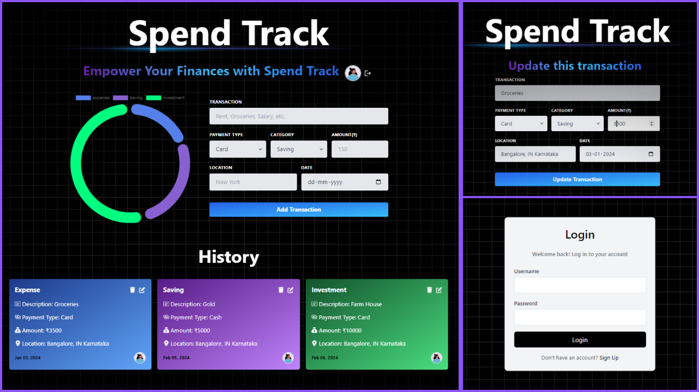

# Spend Track: Full stack MERN app with GraphQL for tracking expenses

Crafted a GraphQL project Spend Track, a full-stack expense tracker app using Express, MongoDB, React, and Apollo. The course covers essential topics such as type definitions, resolvers, mutations, authentication, global state management, error handling, deployment with Render, and cron jobs for automation.

## Technologies Utilized

- **Express**
- **MongoDB**
- **React**
- **Apollo**
- **Cron Jobs, much more**

## Deployment 
This web app is deployed on Render. 
